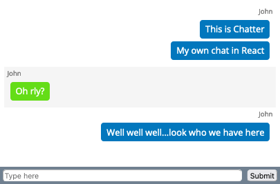

# Chatter

---

Chat app built with React

To set up:

- Install dependencies using command `npm install`
- Start the NodeJS server from root using `node ./server/server.js`
- In browser, go to `localhost://3400`
- Enter a message to see it in chat.
- Chat amongst multiple clients in different tabs of a browser.

